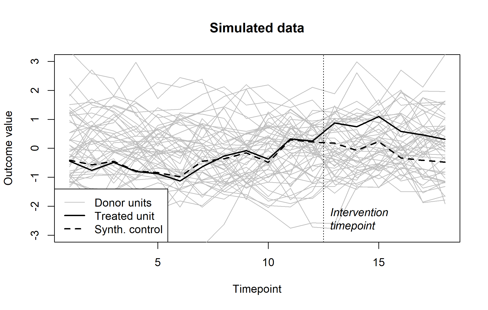

# Penalized synthetic control estimation

[](https://github.com/vankesteren/pensynth/actions/workflows/R-CMD-check.yaml)
[](https://vankesteren.r-universe.dev/pensynth)
[](https://cran.r-project.org/package=pensynth)
[](https://www.repostatus.org/#active)

The goal of `pensynth` is to make it easier to perform penalized synthetic control in the spirit of [Abadie & L'Hour (2021)](https://doi.org/10.1080/01621459.2021.1971535). 

## Features
- Faster and more memory-efficient than the original `Synth::synth` implementation for synthetic controls, because we use the [`clarabel`](https://oxfordcontrol.github.io/ClarabelDocs/stable/) quadratic program solver with sparse matrices.
- Built-in hold-out validation on the pre-intervention outcome timeseries to determine the penalty parameter (see example below).
- Plotting of the full solution path for hold-out validated penalized synthetic controls.
- Placebo permutation testing of the post-intervention average treatment effect (ATE)

> [!NOTE]
> pensynth estimates unit weights, but variable weights have to be pre-specified. This is by design.

## Installation

I recommend installing the latest version of `pensynth` from [r-universe](https://vankesteren.r-universe.dev/pensynth) like so:

```r
install.packages("pensynth", repos = c("https://vankesteren.r-universe.dev", "https://cloud.r-project.org"))
```

The package is also on CRAN, so it can be installed directly from there too.

```r
install.packages("pensynth")
```

The latest development version can also be installed from this repository:

```r
remotes::install_github("vankesteren/pensynth")
```

## Why penalization?

Penalized synthetic control yields a smooth transition between the synthetic control method (when $\lambda = 0$) and nearest neighbour matching (when $\lambda \to \infty$).

When the treated unit is in the convex hull of the donor units (which is more likely when there are many donors) there is no unique solution for the unit weights of synthetic control. In these cases especially, the penalty can help because it prefers solutions with donors closer in covariate space. 

The `pensynth` implementation achieves this through optimizing the following objective:

```math
\min_{\boldsymbol{w}} \left[ \| \boldsymbol{x}_1 - \boldsymbol{X}_0 \boldsymbol{w} \|^2 + \lambda \sum_{d\in D} \boldsymbol{w}_d \|\boldsymbol{x}_1 - \boldsymbol{x}_{d}\|^2 \right]
```

```math
\text{s.t.} \quad \boldsymbol{w}_1 \geq 0, ..., \boldsymbol{w}_D \geq 0,
\, \sum_{d\in D} \boldsymbol{w}_d = 1
```

Where 
- $\boldsymbol{x}_1$ is the column vector of treated unit covariates,  
- $\boldsymbol{X}_0$ are the covariate values for the donor units, 
- $D$ is the number of donor units, 
- $\lambda$ is the penalty parameter, and 
- $\boldsymbol{x}_{d}$ is taken to be the $d^{th}$ column of $\boldsymbol{X}_0$.

The first term in the objective is the same (up to variable weights) as the original synthetic control, and the second term is the nearest neighbour matching penalty.

## Example

Here, we perform pensynth with a simple simulated dataset.

```r
library(pensynth)
set.seed(45)

# Generate some data with a 0.8SD effect
dat <- simulate_data(treatment_effect = 0.8)
```


```r
# Run penalized synthetic control
# estimate lambda using pre-intervention timeseries MSE
fit <- cv_pensynth(
  X1 = dat$X1, # Treated unit covariates
  X0 = dat$X0, # Donor unit covariates
  Z1 = dat$Z1, # Treated unit hold-out values (pre-intervention outcome)
  Z0 = dat$Z0  # Donor unit hold-out values
)
plot(fit)
```


We can then use the `predict()` method to compute the synthetic control
```r
# Compute average treatment effect post-intervention
Y1_synth <- predict(
  object = fit, 
  newdata = dat$Y0 # Donor units post-intervention outcome
)
mean(dat$Y1 - Y1_synth)
#> [1] 0.8780154
```

# References

Abadie, A., & L’Hour, J. (2021). A penalized synthetic control estimator for disaggregated data. _Journal of the American Statistical Association, 116_(536), 1817-1834.

Some of the code was inspired by (but heavily adapted from) [jeremylhour/pensynth](https://github.com/jeremylhour/pensynth). Where this was the case, the code is commented.
